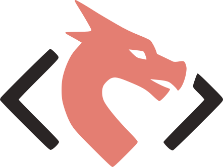
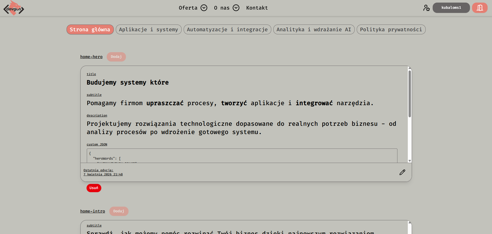
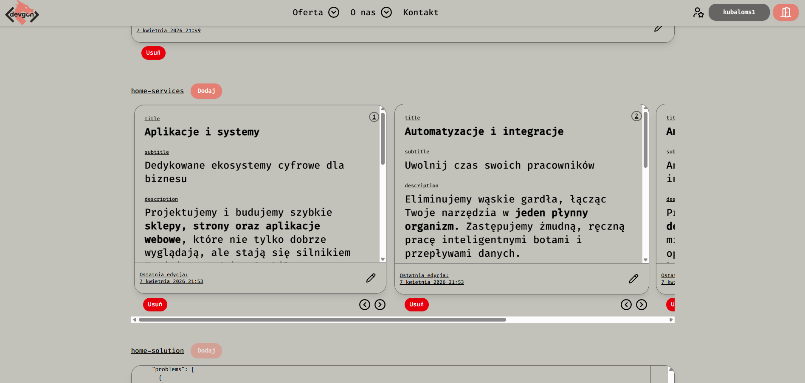
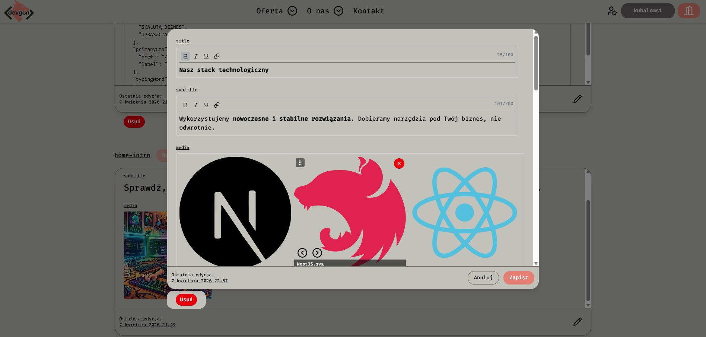

<h1> devgon</h1>

**devgon** is an IT services brand specializing in custom web applications, automations, and AI implementations.

## Code-first CMS - devgon's core product

**A fullstack framework that lets developers build custom websites and products where the frontend structure
is directly mirrored into a powerful, configurable CMS - without sacrificing design freedom.**

You build your UI freely in Next.js.  
devgon gives you the tools to turn any part of that UI into structured, admin-editable content - without rewriting
everything from scratch.

Live project: **[devgon.pl](https://devgon.pl)**  
Contact: **devgonteam@gmail.com**

---

## 🧠 The Problem

**Building without a CMS:**

- every piece of content requires its own database model, API, admin form, and validation

**Using a traditional CMS:**

- you design data models first, then force your UI to fit them

**Both approaches are slow and rigid.**

---

## 🚀 What devgon Solves

devgon introduces a **universal content layer** between your frontend and backend.

1. Build the frontend the way you want
2. Decide what parts should be editable
3. Map them into structured content using devgon's admin components

Static UI becomes a CMS-driven application - without touching backend logic each time.

---

## 🧩 Architecture

### Backend - Content Engine (NestJS + GraphQL + PostgreSQL + MinIO)

A single universal `Content` entity handles all structured data:

| Field         | Type            | Purpose                         |
|---------------|-----------------|---------------------------------|
| `title`       | `varchar(1000)` | Short headline or name          |
| `subtitle`    | `varchar(1000)` | Supporting text                 |
| `description` | `text`          | Rich HTML content (Tiptap)      |
| `customData`  | `jsonb`         | Any additional structured data  |
| `media`       | `OneToMany`     | Images / Videos stored in MinIO |
| `key`         | `varchar(255)`  | Maps content to a page section  |
| `order`       | `integer`       | Sort position within a section  |

The `customData` JSONB field is the escape hatch - it can hold anything: CTA buttons, tag lists, color highlights,
feature flags, nested objects. This means a developer can extend any content block without schema migrations.

**Authorization stack:**

- OAuth2 via Google (GCP)
- Dual JWT: access + refresh tokens in HttpOnly cookies
- Role-based access (`admin` required for content editing)
- REST APIs

### Frontend - Next.js + Tailwind + shadcn/ui

**Developer workflow:**

```tsx
// 1. Define what fields a section needs
<ContentCardManager
    contentKey="systems-hero"
    mode="single"
    fields={{title: 100, subtitle: 0, description: 500, customData: 1000}}
    maxMedia={1}
/>
```

```ts
// 2. Consume in user-facing components with fallback support
const heroCMS = contents["systems-hero"]?.[0];
const hero: ContentOrFallback = heroCMS ?? fallbacks.hero;
```

The admin panel becomes a **structured mirror** of the real UI - no duplicated models, no rigid CMS constraints.

**Admin panel features:**

- Inline editing with live preview
- Rich text editor (Tiptap) for description fields
- JSON editor for `customData` with validation
- Drag-and-drop reordering (desktop) + directional buttons (mobile)
- Media upload and management
- SWR-powered revalidation (ISR-compatible)

---

## 📸 Admin Panel

> Screenshots from the live admin interface:







---

## 🔄 Development Flow

```
Developer builds UI
       ↓
Wraps editable sections in ContentCardManager
       ↓
Backend stores content in universal schema
       ↓
Frontend fetches via GraphQL with ISR
       ↓
Admin edits content live in the panel
       ↓
Pages revalidate automatically
```

No duplicated models. No rewriting APIs. No rigid CMS constraints.

---

## 🧬 devgon vs Traditional CMS

|                   | Traditional CMS       | devgon             |
|-------------------|-----------------------|--------------------|
| Starting point    | Design database first | Design UI first    |
| Flexibility       | UI must adapt to CMS  | CMS adapts to UI   |
| Custom fields     | Schema migrations     | `customData` JSONB |
| Developer control | Limited               | Full               |

---

## ⚡ Tech Stack

| Layer          | Technology                                       |
|----------------|--------------------------------------------------|
| Frontend       | Next.js, Tailwind CSS, shadcn/ui, Framer Motion  |
| Backend        | NestJS, GraphQL, REST                            |
| Database       | PostgreSQL (TypeORM)                             |
| Storage        | MinIO                                            |
| Auth           | OAuth2 (GCP), JWT (dual-token, HttpOnly cookies) |
| Infrastructure | Docker Compose, nginx, VPS (Ubuntu)              |
| CI/CD          | GitHub Actions                                   |
| Analytics      | Self-hosted Umami                                |

---

## ⚙️ Local Setup

### Prerequisites

- Docker & Docker Compose
- Node.js 20+

### Run with Docker

```bash
docker compose -f docker-compose.dev.yml up
```

### Backend (`/backend`)

```bash
cp .env.example .env   # fill in required values
npm install
npm run dev
```

### Frontend (`/frontend`)

```bash
cp .env.example .env   # fill in required values
npm install
npm run dev
```

> **Note:** The content editor and admin panel are only available to users with the `admin` role.

---

## 📄 License

This project is licensed under a **custom non-commercial license**.  
Use is only permitted with **explicit personal consent from the author**.

See the [LICENSE](./LICENSE) file for details.